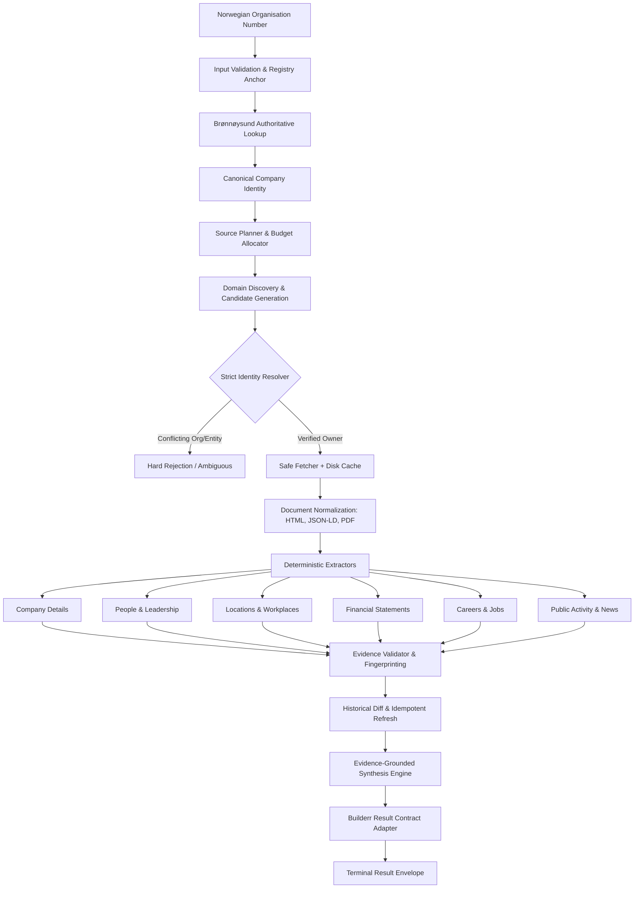

# Architecture & Pipeline Design

Signalpost is designed as a deterministic, multi-stage, evidence-bounded intelligence agent. Every stage adheres to strict error boundaries, ensuring that failures on individual sources or companies never compromise the global batch evaluation.

---

## 1. Pipeline Architecture Diagram

---

## 2. Stage Breakdown

### Stage 1: Input Validation & Canonical Registry Anchor
- The 9-digit Norwegian organisation number serves as the primary immutable entity key.
- Authoritative baseline data is retrieved from Brønnøysundregistrene (Enhetsregisteret):
  - Legal name, legal form (AS, ASA, ENK, etc.), registration status, municipality, NACE industry codes, registered employee count, accounting obligation assessment, and latest submitted annual account year.

### Stage 2: Source Planning & Budget Allocation
- To remain comfortably within the 2,000 global request cap for 100 companies (~20 requests/company ceiling):
  - Initial request plan targets ~8–12 requests per company.
  - Priority requests: 1 registry entity, 1 annual accounts, 1 roles, 1 subunits, 1 homepage, 2–3 key subpages (`/om-oss`, `/kontakt`, `/karriere`).
  - Request budget tracker halts low-priority discovery when approaching the soft limit (1,750 requests).

### Stage 3: Entity Resolution & Verification Gate
- Candidate domains and social links are evaluated through a strict scoring function:
  - **Hard Rejection**: Different organisation number, conflicting registered entity, or parked domain placeholder.
  - **Verified (Score >= 0.90)**: Exact organisation number found on site, or all legal name tokens match with substantive content.
  - **Ambiguous / Quarantined**: If verification is uncertain, the domain is not adopted as an official company source.

### Stage 4: Safe Fetching & Content-Addressed Caching
- Asynchronous HTTP client (`httpx.AsyncClient`) with connection pooling and domain concurrency throttling.
- **SSRF Defense**: Resolves DNS before requests; blocks private IPv4 (RFC1918), loopback (127.0.0.0/8, ::1), link-local (169.254.0.0/16), cloud metadata services, and non-http/https schemes.
- **SHA-256 Cache**: Raw responses and headers are cached on disk, enabling zero redundant network calls and idempotent replays.

### Stage 5: Deterministic Fact Extraction
- Priority order: Structured data (JSON-LD, microdata) -> HTML semantic elements & tables -> Regex/text rules -> Fallbacks.
- **Financial Extractor**: Normalizes NOK amounts, scales (thousands/millions), parses reporting periods, and never invents zero for missing entries.
- **People Extractor**: Extracts official roles (daglig leder, styreleder, styremedlemmer) with active/inactive flags.
- **Workplaces & Locations**: Separates registered address from subunit operational locations.

### Stage 6: Evidence Fingerprinting & Idempotent Refresh
- Every claim is tied to an `evidence` record with source URL, retrieval timestamp, content SHA-256, and text snippet.
- Facts are identified by semantic SHA-256 fingerprints (excluding retrieval dates).
- Diff engine compares against prior profile snapshots:
  - Unchanged facts produce no duplicate records.
  - Genuine updates emit typed changes (`updated_role`, `financial_update`).
  - Source timeouts or HTTP 5xx are recorded as `unobserved`, never as confirmed business removals.

### Stage 7: Evidence-Grounded Synthesis & Result Adapter
- Deterministic briefing generator synthesizes facts without hallucinating external claims.
- The output adapter maps the internal profile into the exact Builderr JSON envelope contract with valid availability states.
